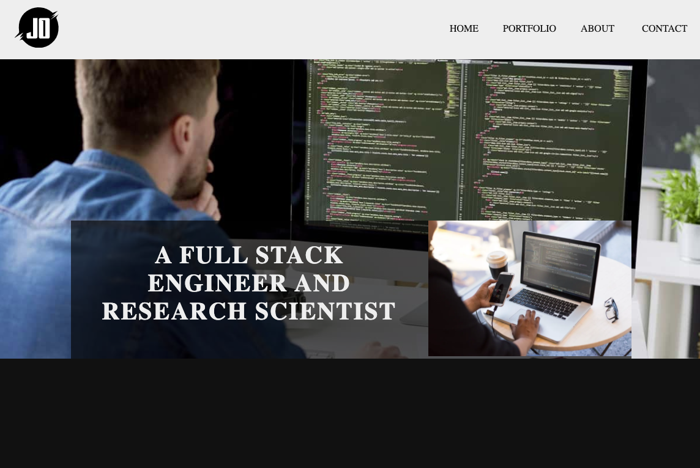

# Awesome-template
All the projects are based on [Bootstrap4](http://startbootstrap.com/) framework.

## Preview

<table>
    <tbody>
        <tr>
            <td>
                 
                <a href="https://andy6804tw.github.io/awesome-template/card-slider">card-slider</a>
            </td>
            <td>
                 
                <a
                    href="https://andy6804tw.github.io/awesome-template/landing-page-with-parallax">landing-page-with-parallax</a>
            </td>
            <td>
                 
                <a
                    href="https://andy6804tw.github.io/awesome-template/api-application-programming-interface">api-application-programming-interface</a>
            </td>
        </tr>
        <tr>
            <td>
                 
                <a href="https://andy6804tw.github.io/awesome-template/data-protection">data-protection</a>
            </td>
            <td>
                 
                <a href="https://andy6804tw.github.io/awesome-template/digital-face">digital-face</a>
            </td>
            <td>
                 
                <a href="https://andy6804tw.github.io/awesome-template/asymmetrical-layout">asymmetrical-layout</a>
            </td>
        </tr>
        <tr>
            <td>
                 
                <a href="https://andy6804tw.github.io/awesome-template/personalise-portfolio">personalise-portfolio</a>
            </td>
            <td>
                 
                <a href="https://andy6804tw.github.io/awesome-template/norwegian-municipality">norwegian-municipality</a>
            </td>
            <td>
                 
                <a href="https://andy6804tw.github.io/awesome-template/matrix-bar">matrix-bar</a>
            </td>
        </tr>
    </tbody>
</table>
